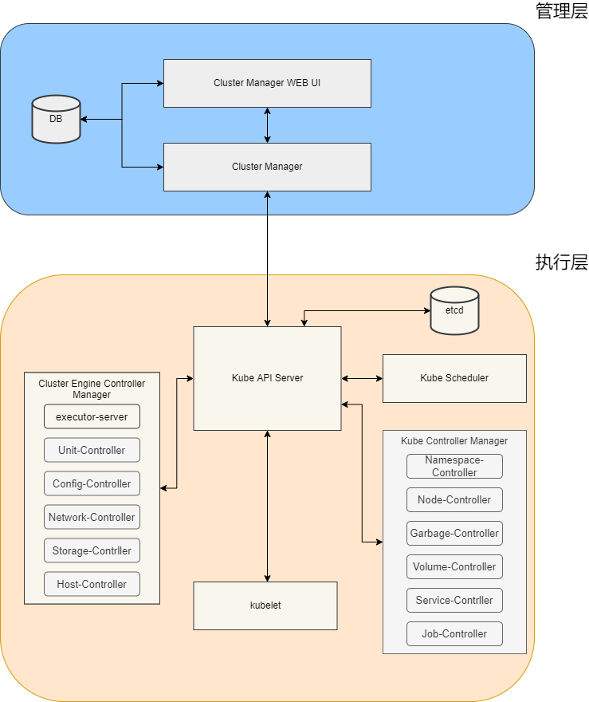

# sea-coral

------

### 项目简介

sea-coral是一个开源数据库运维管理平台系统，着力于研究将MySQL容器化，构建数据库资源池，从而提供标准的数据库PaaS服务。该项目是浦发银行在开源技术领域的研究课题之一。

sea-coral基于docker+kubernetes技术，架构上分为管理层及执行层。管理层主要包含WEB UI及cluster manager，即包含了交互界面及对MySQL资源池的管理模块和管理逻辑，如基础设施资源管理、服务架构管理、任务执行管理、组件的角色注册、状态管理、状态实时通报等；执行层由Cluster Engine组成，利用自定义的CRD第三方资源定义对象将执行逻辑通过controller方式在Kubernetes原生API接口层进行扩展，友好兼容Kubernetes。下图是整体的系统架构图：

------

### 项目功能

1. sea-coral支持对MySQL基础设施资源进行管理，包含计算、存储、网络等

2. sea-coral支持MySQL服务的运维管理

3. sea-coral支持MySQL高可用管理

#### **资源管理**

sea-coral提供完整的资源管理功能，实现对平台的软硬件资源进行统一规划、入库、初始化、配置等管理，包含计算主机，持久化存储，IP地址，配置文件模版等，为自动调度资源提供软硬件资源池。

#### **数据库运维管理**

sea-coral支持对MySQL数据库全生命周期的运维管理，提供包含创建，删除，资源扩容，版本升级，启动，停止，备份，还原，参数配置，用户管理，库管理等。

#### **MySQL高可用管理**

sea-coral支持MySQL高可用方案，通过ProxySQL作为访问入口代理，集成高可用组件SWM进行故障检测和故障自动判断转移。

------

### 场景作业说明

#### 工单申请

提供图形化方式递交MySQL服务创建的需求，可对资源范围，服务版本，资源规模，服务架构等进行配置

#### 数据库自动部署

根据递交工单的内容，自动创建MySQL服务实例和相关的ProxySQL代理服务和高可用服务，并自动配置关联的配置

#### 数据库运维操作

提供数据库服务创建，删除，资源扩容，版本升级，启动，停止，备份，还原，参数配置，用户管理，库管理等

#### 数据库高可用管理

提供高可用MySQL服务架构，包含ProxySQL代理和服务高可用自动切换组件

### 部署安装

sea-coral基于ansible进行安装,详见[sea-coral部署文档](./deployment.md)

### 监控系统

sea-coral监控基于prometheus,通过grafan界面进行展示

### 快速入门

请参考官方文档:[sea-coral部署文档](./deployment.md)

### 许可证

[Apache License 2.0](./LICENSE)

#####
